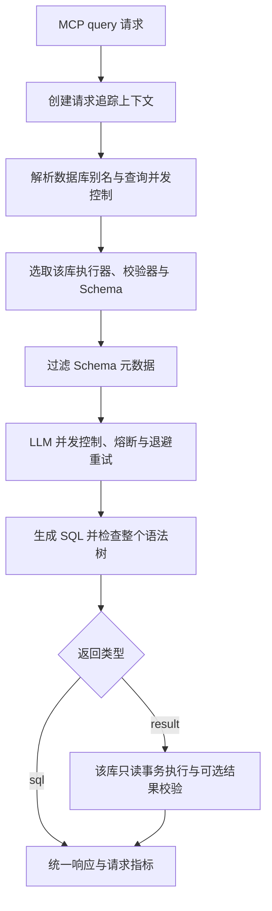

# 研发作业完成说明

## 作业依据

本作业依据目录中的 `readme.png` 和 `readme.docx`，实现第五章第四节 Codex Review 指出的三个缺口。参考仓库：<https://github.com/tyrchen/geektime-bootcamp-ai/tree/master/w5/pg-mcp>。

参考版本为 `4f1be7c93cb14858d91e7aaf33d5f44388cc4302`。实现保留原有 Python、asyncpg、SQLGlot、Pydantic 和 MCP 技术栈。

## 要求与实现对应

| 作业要求 | 完成内容 | 主要代码 |
| --- | --- | --- |
| 多数据库支持 | 通过 DATABASES 配置数据库别名，启动时创建全部连接池、执行器和校验器；按请求别名选取执行器，多库省略别名时拒绝请求 | `config/settings.py`、`server.py`、`services/orchestrator.py` |
| 表、列访问控制 | 全局和每库独立策略；阻止敏感表、字段、通配符和整行引用；检查别名、CTE、子查询、UNION 中的引用；过滤发送给 LLM 的 Schema | `services/sql_validator.py` |
| EXPLAIN 策略 | 默认关闭；开启后仅支持普通 EXPLAIN SELECT/WITH，并递归验证内部 SQL；拒绝 ANALYZE、写操作、危险函数和受限对象 | `services/sql_validator.py` |
| 限流 | 查询与 LLM 使用独立的并发限制；超时返回结构化错误；成功、失败和任务取消均释放许可 | `resilience/rate_limiter.py`、`services/orchestrator.py` |
| 重试与退避 | 暂时性 LLM 故障、明确的暂时性数据库 SQLSTATE 使用指数退避；SQL 校验失败携带反馈重新生成；认证错误、普通 SQL 错误不重试 | `services/orchestrator.py`、LLM 服务类 |
| 熔断 | 两种 LLM 调用共享熔断器；每次调用检查状态、记录结果；半开阶段只允许一个恢复探测；取消探测可释放状态 | `resilience/circuit_breaker.py` |
| 指标与追踪 | 查询结果和耗时、LLM 调用次数与 Token、SQL 拒绝、数据库耗时和缓存年龄均接入实际流程；ContextVar 隔离并发请求的 request_id | `observability/*`、`services/orchestrator.py` |
| 响应模型 | 删除重复 to_dict；统一 JSON 序列化；tokens_used 始终为整数；模型级验证成功/错误一致性；自动同步 row_count | `models/query.py` |
| 配置和测试 | 修复扁平 .env 加载、连接池上下界、字段策略和限流配置；开启缓存容量限制与可选自动刷新；新增回归测试与覆盖率报告 | `config/settings.py`、`cache/schema_cache.py`、`tests/unit/*` |

以上 `src` 路径均相对于 `src/pg_mcp/`。

## 请求处理流程



原实现把主库执行器传入编排器，即使请求选择其他数据库，也可能执行到主库。现在根据别名取 `sql_executors[database]`，多库场景缺少对应执行器时直接失败，不回退到主库。Schema、访问策略和执行器使用同一个数据库别名。

SQL 生成调用和结果校验调用都经过 LLM 并发控制与熔断器；重试等待在释放 LLM 许可后进行。SDK 内置重试关闭，避免与编排层重复重试。SQL 安全校验失败属于生成质量问题，不计入外部服务故障次数。

会话参数改为 SET LOCAL，使超时、search_path 和只读角色仅在当前事务中有效。启动过程中部分数据库连接失败时，已创建的连接池也会清理。退出时关闭 LLM 客户端与指标 HTTP 服务，并清空全局状态。

## 响应示例

成功执行时，返回 SQL、数据、置信度、Token 数及 request_id。执行结果示例：

```json
{
  "success": true,
  "generated_sql": "SELECT COUNT(*) FROM users;",
  "data": {"columns": ["count"], "rows": [{"count": 42}], "row_count": 1, "execution_time_ms": 12.5},
  "confidence": 90,
  "confidence_acceptable": true,
  "tokens_used": 120,
  "request_id": "example-request-id"
}
```

示例数值仅说明结构。SQL 只返回模式不执行数据库查询。可选结果校验故障时保留查询数据，但置信度降为 0，不再伪装为 100；禁用结果校验时沿用 100。是否达到置信度要求同时考虑两个已有阈值配置。

## 验证结果

在 Windows / Python 3.13.12 中执行，结果为：

- **346 项通过，46 项跳过，0 项失败。** 跳过项是需要实际 PostgreSQL 与 API key 的课程集成/E2E 测试。
- **整体覆盖率 90.94%**，统计包含分支。
- SQL 安全校验模块覆盖率 **97%**；SQL 执行器 **99%**；编排器 **97%**；熔断和限流模块 **100%**。
- `ruff check src tests main.py` 通过。
- `mypy src --no-incremental` 通过。
- SDK 工具注册检查确认实际注册工具为 `query`。
- `git diff --check` 通过。

新增回归测试覆盖：两个数据库的独立路由、多库不指定别名、未知数据库、缺少执行器、每库策略、SQL 只返回、敏感字段绕过、危险 EXPLAIN、原始 SQL 提取保留完整语句、退避时间、瞬时故障与认证故障分类、熔断阻断、并发拒绝、任务取消释放许可、并发 request_id 隔离、Token 序列化、.env 加载、启动失败清理，以及日志与结果校验。

测试证据：`test-results.xml`、`coverage.json`、`htmlcov/index.html`。运行命令见 README。

## 运行条件与边界

实际使用时需在 `.env` 填入数据库连接信息与有效 API key。本次未提供这些凭据，因此没有运行真实数据库/API 联调，也没有构建 Docker 镜像。

访问策略使用保守匹配：限定名 `users.password` 会同时阻止其他表的同名字段，有字段限制时拒绝通配符和整行输出。对视图与自定义函数的间接权限必须使用数据库原生授权控制；应用层黑名单不能替代数据库权限。

限流为单进程并发控制，未实现分布式 QPS 限流。返回行数仍采用原有“获取后截断”方式，未实现流式大结果集。上述边界已在 README 中明确。

启动入口原本是一个返回固定数值的加法示例，现已改为真正的 PostgreSQL MCP 入口。Python 最低版本调整为 3.12，默认版本为本次验证的 3.13；依赖锁文件已重新生成，避免新 MCP 主版本破坏课程接口。
